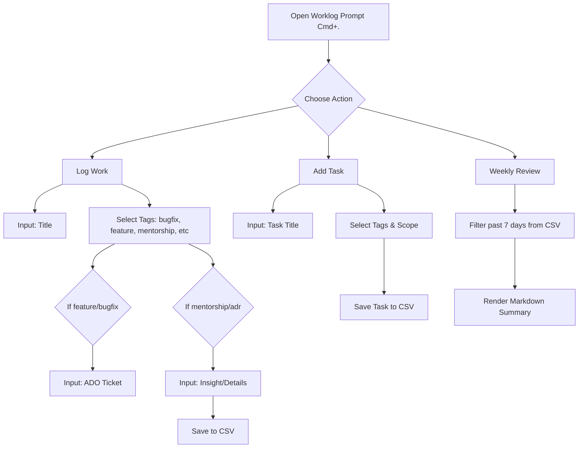

# Project: worklog

A local-first, keyboard-driven GUI app for engineers to track their daily work, contributions, and performance insights via a Raycast-style prompt interface.

---

## 🧱 Tech Stack (MVP)

- **UI**: Tauri + React (for better performance and smaller footprint)
- **Storage**: Local CSV files only
- **Notifications**: Native notifications (Tauri)
- **Keybinding**: Configurable system-wide hotkey (e.g. Cmd+.)
- **Target OS**: macOS (MVP), extendable to others
- **Yarn**: NPM package manager

---

## 🧭 User Flows

### 1. Add Task or Note

- Trigger: `Cmd+.` (system-wide) or tray icon
- Opens modal with:
  - Title input
  - Badge-style tag selector (configurable tags from settings)
  - Conditional fields:
    - If `feature` or `bugfix`: Azure DevOps ticket input (text field)
    - If `mentorship` or `adr`: Insight/details input
  - Auto-tagging based on input text
  - Multiple tags supported (lowercase, snake_case)

### 2. View Open Tasks

- Access via tray menu or shortcut (e.g. `Cmd+Shift+O`)
- Table of tasks with filters: `open`, `done`, `tags`, `date`
- Tasks are editable; can be marked done

### 3. Close Task

- Trigger via button or shortcut in task view

### 4. End-of-Day Prompt

- At configured time (e.g. 4:30pm), show system notification
- When clicked, opens modal with:
  - What did you ship?
  - Any decisions?
  - Mentorship moments?
- Tagging suggestions and custom entry allowed
- Each question creates separate CSV entries

### 5. Weekly Summary

- Trigger from menu
- Gathers tagged logs from past 7 days
- Generates markdown report (shown in-app and saved to file)

### 6. KPI Dashboard

- Modal view
- Tallies by tag: `features`, `bugfixes`, `mentorship`, `adr`
- Auto-updated from logs

### 7. Configure Keybinds

- Config file or simple dropdowns
- Defaults: `Cmd+.` (open prompt), `Cmd+Shift+O` (open tasks)
- System-wide hotkey registration

### 8. Configure Notifications

- Toggle reminders on/off
- Set EOD time

### 9. Configure Tags

- Define available tags in settings
- Support for custom tags
- Auto-tagging rules configuration

---

## 📁 File Structure

```
worklog/
├─ src/
│  ├─ components/
│  ├─ views/
│  ├─ services/
│  ├─ utils/
│  ├─ main.ts
│  ├─ index.tsx
├─ package.json
```

**Data Storage**: `~/.worklog/` directory on user's machine

- `~/.worklog/worklog.csv` - Main work entries
- `~/.worklog/config.json` - User configuration

---

## 🧾 CSV Format

```csv
date,title,tags,ado_ticket,details,status
2025-07-03,Fix OAuth bug,"bugfix|auth",ABC-123,,open
2025-07-03,Auth redesign,"adr|architecture",,"Decouple token from session",done
2025-07-03,Mentored intern,"mentorship",,"Explained async queue design",done
```

---

## 🧠 Mermaid Wireframe



---

## 🔧 Installation Instructions

### Prerequisites

- Node.js >= 18
- Rust (for Tauri)
- macOS (for MVP)

### Setup

```bash
git clone https://github.com/sdavisde/worklog
cd worklog
yarn install
yarn tauri dev
```

> Install Rust & Tauri dependencies: https://tauri.app/v1/guides/getting-started/prerequisites

---

## ✅ MVP Goals

- [ ] System-wide global hotkey opens prompt
- [ ] Intake modal with configurable tag selection and conditional fields
- [ ] Task manager view
- [ ] CSV storage for logs and tasks
- [ ] KPI summary view
- [ ] Weekly markdown export (in-app + file)
- [ ] End-of-day system notification
- [ ] Tag configuration system

---

## 🌱 Future Enhancements

- Azure DevOps integration (preview ticket names and links)
- Smart NLP-based auto-tagging
- Notion/Markdown sync
- Timeline/calendar view
- Cloud task synchronization (optional)
